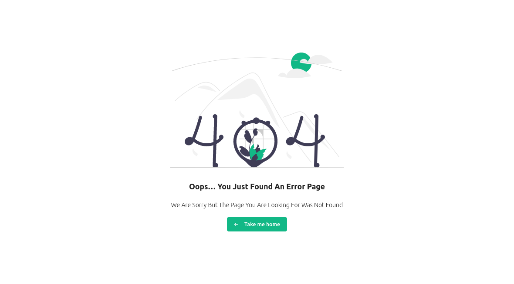
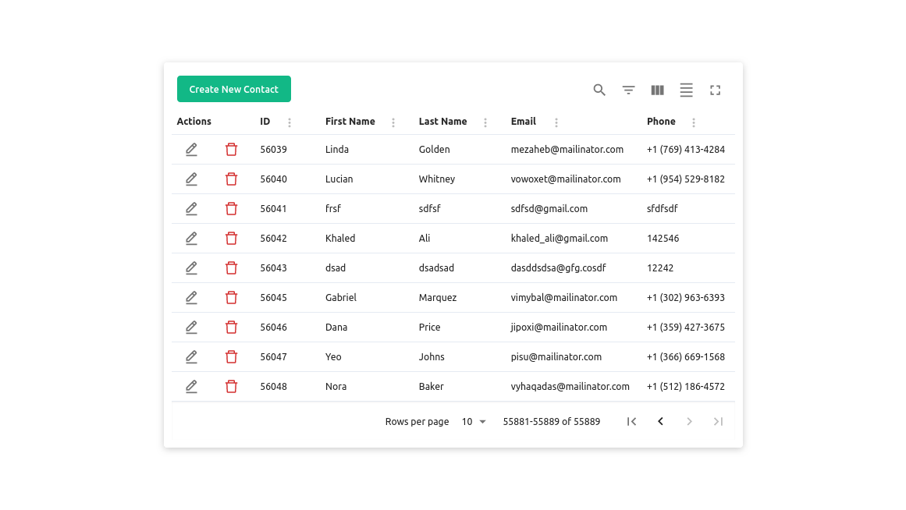
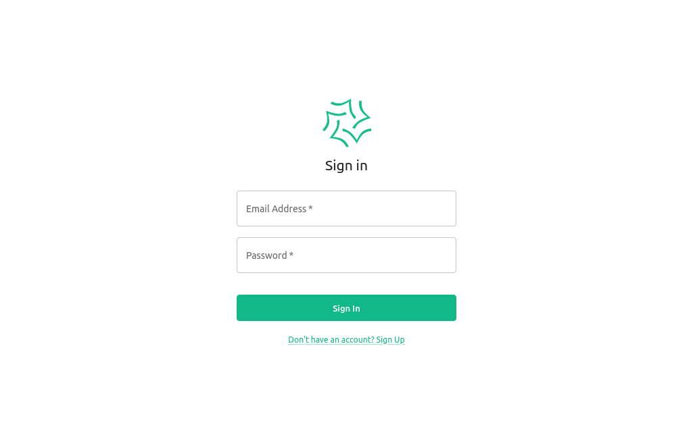
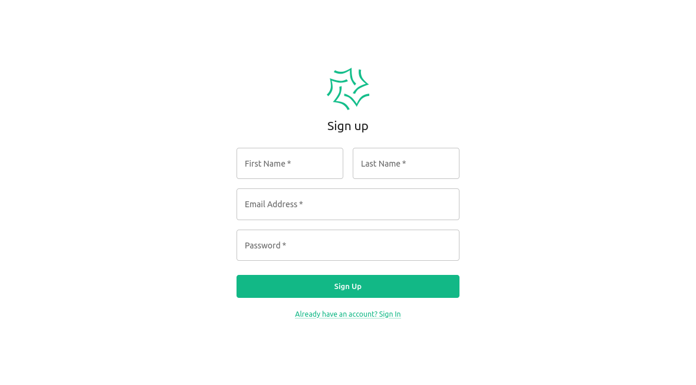

# Dynamics Task

React.js task based on a Contacts API with auth credentials

[demo](https://mohammed-taysser.github.io/dynamic-task)

## Pages 📃

| Page     | Path        |
| -------- | ----------- |
| Contacts | `/`         |
| 404      | `*`         |
| Sign In  | `/login`    |
| Sign Up  | `/register` |

## Features 🎮

- Modern and responsive layout
- Written in TypeScript with predictable static types.
- Use Redux with redux-toolkit Store
- Lint using Eslint
- Minimal need for any custom CSS.

## Get Start 🚀

These instructions will help you set up and run the project on your local machine for development and testing purposes.

### Prerequisites

Make sure you have the following software installed on your system:

- Node.js (v14 or higher)
- npm (v6 or higher)

### Using Git (recommended)

```shell
# clone it with git version control:
git clone https://github.com/Mohammed-Taysser/dynamic-task.git

# change directory:
cd dynamic-task

# Install dependencies:
npm install
```

### Using manual download ZIP

1. Download repository from [Here](https://minhaskamal.github.io/DownGit/#/home?url=https://github.com/Mohammed-Taysser/dynamic-task)
2. Uncompressed to your desired directory

## Available Scripts 🤖

### Development

```shell
# To start the development server:
# The application will be available at
# http://localhost:5173/dynamic-task
npm run dev
```

### Linting

```shell
# To run ESLint for code linting:
npm run lint
```

### Deployment

```shell
# To deploy the project to GitHub Pages:
npm run deploy
```

## Built With 🧰

- [React](https://reactjs.org/)
- [Typescript](https://www.typescriptlang.org/)
- [Material-UI](https://mui.com/)
- [Redux Toolkit](https://redux-toolkit.js.org/)
- [Axios](https://axios-http.com/)
- [Material React Table](https://www.material-react-table.com/)
- [React Icons](https://react-icons.github.io/react-icons)
- [React Router Dom](https://reactrouter.com/en/main)

## Resources ☁️

- [API Auth](http://62.171.166.157:5050/)
- [API Contacts](http://62.171.166.157:5050/api/contact/)

## Screenshots









## Contribution 🖐️

- Fork it!
- Create your feature branch: `git checkout -b feature-name`
- Commit your changes: `git commit -am 'Some commit message'`
- Push to the branch: `git push origin feature-name`
- Submit a pull request 😉

## License 📜

MIT © [Mohammed Taysser](https://github.com/mohammed-Taysser/)
